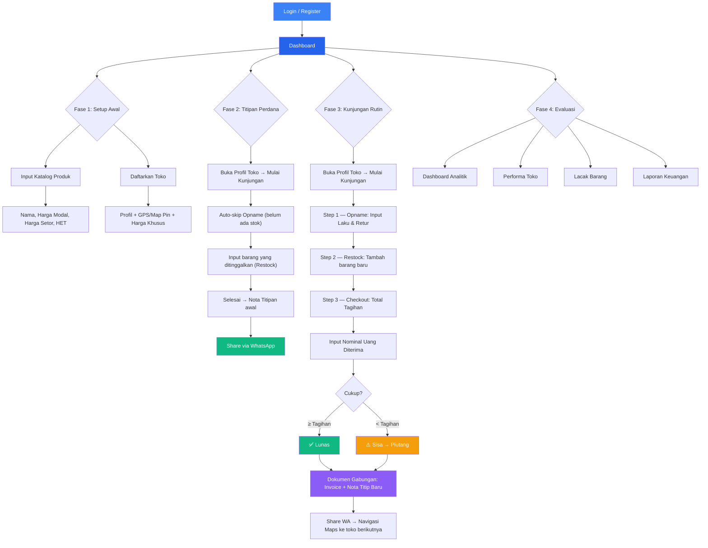
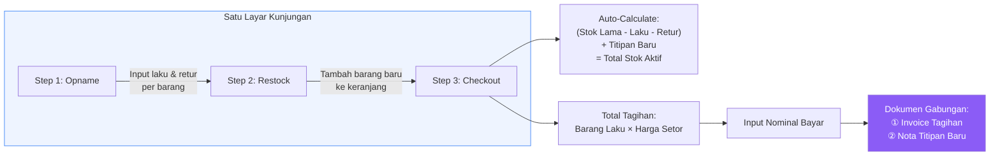
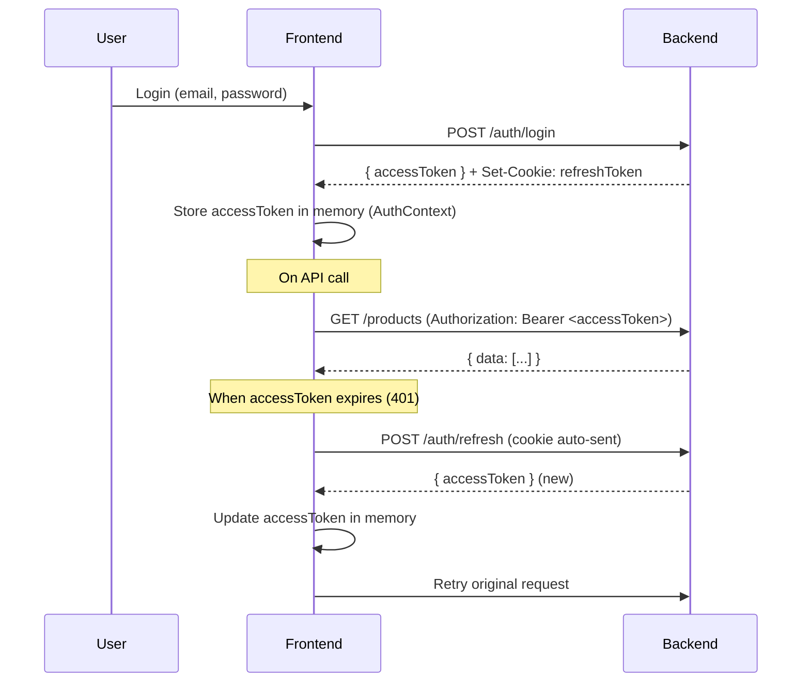

# JuraganTitip — Frontend UI/UX Implementation Plan (v3 — Final)

Aplikasi manajemen bisnis reseller konsinyasi.
Stack: **React + Vite + TypeScript + TailwindCSS v4 + shadcn/ui + lucide-react**.

> [!NOTE]
> **v3.1 Changes:** TypeScript + type safety, localStorage backend (API service layer siap swap ke real backend), JWT auth flow (mock), all open questions resolved.

---

## Resolved Decisions

| #  | Question                 | Decision                                                                                                  |
|----|--------------------------|-----------------------------------------------------------------------------------------------------------|
| 1  | Autentikasi              | Backend handles JWT. Refresh token di cookies, accessToken di payload `/login`, `/register`, `/refresh`.  |
| 2  | State Management         | localStorage sebagai mock backend. API service layer tetap utuh, siap swap ke real API.                   |
| 3  | Chart Library            | `recharts` ✅                                                                                             |
| 4  | TailwindCSS              | v4 confirmed (CSS-first config, `@import "tailwindcss"`)                                                 |
| 5  | Offline-first            | Tidak. Online-only.                                                                                       |
| 6  | Titipan Perdana          | Auto-skip Step 1 (Opname) jika toko belum punya stok titipan.                                            |

### LocalStorage Backend Pattern

Setiap service file berisi:
1. **API call yang sebenarnya** — di-comment, siap untuk integrasi
2. **LocalStorage CRUD** — baca/tulis dari localStorage via generic helper, return type identik dengan ekspektasi API response
3. **Seed data** — data awal demo yang di-load ke localStorage jika belum ada

```typescript
// src/lib/storage.ts — Generic localStorage CRUD utility

export function storageGet<T>(key: string): T | null {
  const raw = localStorage.getItem(key)
  return raw ? (JSON.parse(raw) as T) : null
}

export function storageSet<T>(key: string, value: T): void {
  localStorage.setItem(key, JSON.stringify(value))
}

export function storageGetOrSeed<T>(key: string, seed: T): T {
  const existing = storageGet<T>(key)
  if (existing) return existing
  storageSet(key, seed)
  return seed
}
```

```typescript
// src/services/api/products.ts

import type { Product, ProductFormData, ApiResponse } from "@/types"
import { storageGetOrSeed, storageSet } from "@/lib/storage"
import { seedProducts } from "@/seed-data/products"
// import { apiClient } from "@/lib/api-client"

const STORAGE_KEY = "jt_products"

export const productApi = {
  getAll: async (): Promise<ApiResponse<Product[]>> => {
    // return apiClient.get<ApiResponse<Product[]>>("/products")
    const products = storageGetOrSeed<Product[]>(STORAGE_KEY, seedProducts)
    return { success: true, data: products }
  },

  getById: async (id: string): Promise<ApiResponse<Product>> => {
    // return apiClient.get<ApiResponse<Product>>(`/products/${id}`)
    const products = storageGetOrSeed<Product[]>(STORAGE_KEY, seedProducts)
    const product = products.find((p) => p.id === id)
    if (!product) return { success: false, data: null as unknown as Product, message: "Not found" }
    return { success: true, data: product }
  },

  create: async (data: ProductFormData): Promise<ApiResponse<Product>> => {
    // return apiClient.post<ApiResponse<Product>>("/products", data)
    const products = storageGetOrSeed<Product[]>(STORAGE_KEY, seedProducts)
    const newProduct: Product = {
      id: `prod-${Date.now()}`,
      ...data,
      createdAt: new Date().toISOString(),
      updatedAt: new Date().toISOString(),
    }
    storageSet(STORAGE_KEY, [...products, newProduct])
    return { success: true, data: newProduct }
  },

  update: async (id: string, data: Partial<ProductFormData>): Promise<ApiResponse<Product>> => {
    // return apiClient.put<ApiResponse<Product>>(`/products/${id}`, data)
    const products = storageGetOrSeed<Product[]>(STORAGE_KEY, seedProducts)
    const index = products.findIndex((p) => p.id === id)
    if (index === -1) return { success: false, data: null as unknown as Product, message: "Not found" }
    products[index] = { ...products[index], ...data, updatedAt: new Date().toISOString() }
    storageSet(STORAGE_KEY, products)
    return { success: true, data: products[index] }
  },

  delete: async (id: string): Promise<ApiResponse<null>> => {
    // return apiClient.delete<ApiResponse<null>>(`/products/${id}`)
    const products = storageGetOrSeed<Product[]>(STORAGE_KEY, seedProducts)
    storageSet(STORAGE_KEY, products.filter((p) => p.id !== id))
    return { success: true, data: null }
  },
}
```

```typescript
// src/seed-data/products.ts — Data awal demo

import type { Product } from "@/types"

export const seedProducts: Product[] = [
  {
    id: "prod-001",
    name: "Keripik Singkong",
    category: "Makanan Ringan",
    costPrice: 8000,
    wholesalePrice: 12000,
    retailPrice: 15000,
    warehouseStock: 120,
    description: "",
    createdAt: "2026-05-01T00:00:00Z",
    updatedAt: "2026-05-20T00:00:00Z",
  },
  // ...
]
```

> [!TIP]
> **Swap ke real backend:** Cukup uncomment baris `apiClient` dan hapus/comment baris localStorage di setiap service file. Signature & return type tidak berubah.

### Auth Flow (JWT)

```
┌──────────────────────────────────────────────────────────────┐
│  AUTH FLOW                                                   │
│                                                              │
│  Login/Register                                              │
│  POST /auth/login  → { accessToken: "..." }                  │
│                       Set-Cookie: refreshToken=...; HttpOnly │
│                                                              │
│  Refresh                                                     │
│  POST /auth/refresh → { accessToken: "..." }                 │
│                        (reads refreshToken from cookie)       │
│                                                              │
│  API Calls                                                   │
│  Authorization: Bearer <accessToken>                         │
│                                                              │
│  Frontend Storage:                                           │
│  - accessToken → in-memory (state/context)                   │
│  - refreshToken → HttpOnly cookie (managed by backend)       │
└──────────────────────────────────────────────────────────────┘
```

---

## 1. Design System

### 1.1 Color Palette

Semantic color tokens berbasis HSL, dikelola via TailwindCSS v4 CSS variables.

```
┌─────────────────────────────────────────────────────────────────┐
│  BRAND / PRIMARY                                                │
│  ┌───────┐ ┌───────┐ ┌───────┐ ┌───────┐ ┌───────┐            │
│  │  50   │ │  100  │ │  500  │ │  600  │ │  900  │            │
│  │#EEF4FF│ │#DBEAFE│ │#3B82F6│ │#2563EB│ │#1E3A5F│            │
│  └───────┘ └───────┘ └───────┘ └───────┘ └───────┘            │
│                                                                 │
│  ACCENT / SUCCESS / WARNING / DESTRUCTIVE                       │
│  ┌───────┐ ┌───────┐ ┌───────┐ ┌───────┐                      │
│  │Emerald│ │Amber  │ │Rose   │ │Violet │                      │
│  │#10B981│ │#F59E0B│ │#F43F5E│ │#8B5CF6│                      │
│  └───────┘ └───────┘ └───────┘ └───────┘                      │
│                                                                 │
│  NEUTRAL (Slate scale)                                          │
│  50─100─200─300─400─500─600─700─800─900─950                    │
│  #F8FAFC ─────────────────────────── #020617                    │
└─────────────────────────────────────────────────────────────────┘
```

| Token                | Light Mode    | Dark Mode     | Usage                    |
|----------------------|---------------|---------------|--------------------------|
| `--background`       | slate-50      | slate-950     | Page background          |
| `--surface`          | white         | slate-900     | Card / panel surface     |
| `--surface-elevated` | white         | slate-800     | Modals, dropdowns        |
| `--border`           | slate-200     | slate-700     | Borders, dividers        |
| `--text-primary`     | slate-900     | slate-50      | Headings, body text      |
| `--text-secondary`   | slate-500     | slate-400     | Captions, hints          |
| `--text-muted`       | slate-400     | slate-500     | Disabled, placeholders   |
| `--primary`          | blue-600      | blue-500      | CTA buttons, links       |
| `--primary-hover`    | blue-700      | blue-400      | Hover state              |
| `--success`          | emerald-500   | emerald-400   | Lunas, stok aman         |
| `--warning`          | amber-500     | amber-400     | Piutang, stok menipis    |
| `--destructive`      | rose-500      | rose-400      | Retur, hapus             |
| `--info`             | violet-500    | violet-400    | Badge, highlight         |

### 1.2 Typography

Font utama: **Inter** (Google Fonts).

```
┌──────────────────────────────────────────────────────────────┐
│  TYPOGRAPHY SCALE                                            │
│                                                              │
│  Display    32px / 2rem    800   leading-tight   -0.02em     │
│  H1         24px / 1.5rem  700   leading-tight   -0.01em     │
│  H2         20px / 1.25rem 600   leading-snug    -0.01em     │
│  H3         16px / 1rem    600   leading-normal  0           │
│  Body       14px / 0.875rem 400  leading-relaxed 0           │
│  Body-sm    13px / 0.8125rem 400 leading-relaxed 0           │
│  Caption    12px / 0.75rem 400   leading-normal  0.01em      │
│  Overline   11px / 0.6875rem 600 leading-normal  0.05em      │
│                                                              │
│  Monospace: JetBrains Mono (angka, nominal Rupiah)           │
└──────────────────────────────────────────────────────────────┘
```

### 1.3 Spacing System

Berbasis **4px grid**.

```
┌──────────────────────────────────────────────┐
│  SPACING SCALE (base = 4px)                  │
│                                              │
│  0.5  =  2px    (micro gap)                 │
│  1    =  4px    (inline spacing)             │
│  1.5  =  6px    (tight padding)             │
│  2    =  8px    (compact padding)            │
│  3    =  12px   (default gap)                │
│  4    =  16px   (section padding)            │
│  5    =  20px   (card padding)               │
│  6    =  24px   (section gap)                │
│  8    =  32px   (page padding mobile)        │
│  10   =  40px   (page padding desktop)       │
│  12   =  48px   (section separator)          │
│  16   =  64px   (major section gap)          │
└──────────────────────────────────────────────┘
```

### 1.4 Border Radius

```
  none   = 0px
  sm     = 4px      (badge, tag)
  md     = 8px      (button, input)
  lg     = 12px     (card)
  xl     = 16px     (modal, drawer)
  2xl    = 24px     (floating panel)
  full   = 9999px   (avatar, pill)
```

### 1.5 Shadow Elevation

```
  shadow-xs    box-shadow: 0 1px 2px rgba(0,0,0,0.05)
  shadow-sm    box-shadow: 0 1px 3px rgba(0,0,0,0.1), 0 1px 2px rgba(0,0,0,0.06)
  shadow-md    box-shadow: 0 4px 6px rgba(0,0,0,0.1), 0 2px 4px rgba(0,0,0,0.06)
  shadow-lg    box-shadow: 0 10px 15px rgba(0,0,0,0.1), 0 4px 6px rgba(0,0,0,0.05)
  shadow-xl    box-shadow: 0 20px 25px rgba(0,0,0,0.1), 0 8px 10px rgba(0,0,0,0.04)
```

### 1.6 Iconography

**Lucide React** — ukuran standar:

| Context       | Size   |
|---------------|--------|
| Inline / text | 16px   |
| Button icon   | 18px   |
| Nav item      | 20px   |
| Card header   | 24px   |
| Empty state   | 48px   |

---

## 2. Responsive Breakpoints

```
┌──────────────────────────────────────────────────────────────────────┐
│  BREAKPOINTS (Mobile-first)                                          │
│                                                                      │
│  Default    0px─639px       1 col    Bottom nav     Full-width cards │
│  sm         640px─767px     1 col    Bottom nav     Full-width cards │
│  md         768px─1023px    2 col    Collapsed sidebar (icon-only)   │
│  lg         1024px─1279px   3 col    Expanded sidebar               │
│  xl         1280px─1535px   3 col    Expanded sidebar + panel       │
│  2xl        1536px+         4 col    Expanded sidebar + panel       │
│                                                                      │
│  Layout behavior:                                                    │
│  ┌──────────┐  ┌────────────────┐  ┌──────────────────────────────┐  │
│  │ < 768px  │  │ 768px─1023px   │  │ ≥ 1024px                    │  │
│  │          │  │ ┌──┐           │  │ ┌──────┐                    │  │
│  │  Full    │  │ │  │  Content  │  │ │      │  Content           │  │
│  │  width   │  │ │64│  area     │  │ │ 240px│  area              │  │
│  │  content │  │ │px│           │  │ │      │                    │  │
│  │          │  │ └──┘           │  │ └──────┘                    │  │
│  │ ┌──────┐ │  │                │  │                              │  │
│  │ │ tabs │ │  └────────────────┘  └──────────────────────────────┘  │
│  │ └──────┘ │                                                        │
│  └──────────┘                                                        │
└──────────────────────────────────────────────────────────────────────┘
```

---

## 3. Navigation Architecture

### 3.1 Information Architecture

```
┌─────────────────────────────────────────────────────────────┐
│                    SITEMAP / IA                              │
│                                                             │
│  ┌─ Auth                                                    │
│  │    ├─ Login            (/login)                          │
│  │    └─ Register         (/register)                       │
│  │                                                          │
│  ┌─ Dashboard  (/dashboard)                                 │
│  │    └─ Overview widgets, activity feed, pending visits    │
│  │                                                          │
│  ├─ Produk  (/products)                                     │
│  │    ├─ Daftar Produk    (/products)                       │
│  │    ├─ Tambah Produk    (/products/new)                   │
│  │    ├─ Detail Produk    (/products/:id)                   │
│  │    └─ Edit Produk      (/products/:id/edit)              │
│  │                                                          │
│  ├─ Toko  (/stores)                                         │
│  │    ├─ Daftar Toko      (/stores)                         │
│  │    ├─ Tambah Toko      (/stores/new)                     │
│  │    ├─ Profil Toko      (/stores/:id)                     │
│  │    │   ├─ Tab: Ringkasan (stok aktif, piutang)           │
│  │    │   ├─ Tab: Riwayat Kunjungan                         │
│  │    │   └─ Tab: Harga Khusus (override per produk)        │
│  │    ├─ Edit Toko        (/stores/:id/edit)                │
│  │    └─ Kunjungan        (/stores/:id/visit)               │
│  │         ├─ Step 1: Opname (auto-skip jika first visit)   │
│  │         ├─ Step 2: Restock (titip barang baru)           │
│  │         └─ Step 3: Checkout (tagihan + pembayaran)       │
│  │                                                          │
│  ├─ Keuangan  (/finance)                                    │
│  │    ├─ Daftar Invoice     (/finance/invoices)             │
│  │    ├─ Detail Invoice     (/finance/invoices/:id)         │
│  │    └─ Piutang            (/finance/receivables)          │
│  │                                                          │
│  ├─ Laporan  (/reports)                                     │
│  │    ├─ Performa Toko      (/reports/stores)               │
│  │    ├─ Lacak Barang       (/reports/tracking)             │
│  │    └─ Keuangan           (/reports/financial)            │
│  │                                                          │
│  └─ Pengaturan  (/settings)                                 │
│       ├─ Profil             (/settings/profile)             │
│       └─ Preferensi         (/settings/preferences)         │
└─────────────────────────────────────────────────────────────┘
```

### 3.2 Navigation Pattern

**Desktop (≥1024px):** Sidebar kiri — fixed, expandable.
**Tablet (768─1023px):** Sidebar kiri — collapsed, icon-only, hover-expand.
**Mobile (<768px):** Bottom tab bar — 5 primary tabs + "More" sheet.

```
┌──────────────────────────────────────────────────────────────┐
│  DESKTOP SIDEBAR (240px)                                     │
│                                                              │
│  ┌────────────────────────┐                                  │
│  │  ◈ JuraganTitip        │  ← Logo + brand name            │
│  ├────────────────────────┤                                  │
│  │                        │                                  │
│  │  ▣  Dashboard          │  ← Active: bg-primary/10        │
│  │  ◫  Produk             │    + left-border primary         │
│  │  ◨  Toko               │    + text-primary               │
│  │  ◩  Keuangan           │                                  │
│  │  ◪  Laporan            │  ← Inactive: text-secondary     │
│  │                        │                                  │
│  ├────────────────────────┤                                  │
│  │  ⚙  Pengaturan         │                                  │
│  │                        │                                  │
│  │  ┌────────────────┐    │                                  │
│  │  │ 👤 Nama User   │    │  ← User profile pill             │
│  │  │    reseller     │    │                                  │
│  │  └────────────────┘    │                                  │
│  └────────────────────────┘                                  │
│                                                              │
│  MOBILE BOTTOM TAB BAR                                       │
│                                                              │
│  ┌──────────────────────────────────────────────┐            │
│  │  ▣       ◫       ◨        ◩       •••       │            │
│  │ Beranda  Produk  Toko    Uang   Lainnya     │            │
│  └──────────────────────────────────────────────┘            │
│                                                              │
│  "Lainnya" sheet: Laporan, Pengaturan                        │
└──────────────────────────────────────────────────────────────┘
```

---

## 4. Application Flow Diagram

### 4.1 Overall Flow



### 4.2 Visit Cycle Detail Flow



### 4.3 Auth Flow



---

## 5. Type System

### 5.1 Core Types

```typescript
// src/types/api.ts
interface ApiResponse<T> {
  success: boolean
  data: T
  message?: string
  errors?: Record<string, string[]>
}

interface PaginatedResponse<T> extends ApiResponse<T[]> {
  meta: {
    page: number
    perPage: number
    total: number
    totalPages: number
  }
}

interface AuthResponse {
  accessToken: string
  user: User
}
```

```typescript
// src/types/models.ts
interface User {
  id: string
  name: string
  email: string
  phone: string
  createdAt: string
}

interface Product {
  id: string
  name: string
  category: string
  costPrice: number        // HPP / Modal
  wholesalePrice: number   // Harga Setor standar
  retailPrice: number      // HET
  warehouseStock: number   // Stok gudang
  description: string
  createdAt: string
  updatedAt: string
}

interface Store {
  id: string
  name: string
  ownerName: string
  phone: string
  address: string
  latitude: number
  longitude: number
  notes: string
  activeItemCount: number
  totalReceivable: number  // Total piutang
  createdAt: string
  updatedAt: string
}

interface StorePrice {
  id: string
  storeId: string
  productId: string
  productName: string
  standardPrice: number    // Harga setor standar dari katalog
  customPrice: number      // Harga khusus untuk toko ini
}

interface Consignment {
  id: string
  storeId: string
  storeName: string
  items: ConsignmentItem[]
  status: "active" | "checked"
  createdAt: string
}

interface ConsignmentItem {
  id: string
  productId: string
  productName: string
  quantity: number          // Jumlah dititip
  wholesalePrice: number   // Harga setor (bisa override)
  retailPrice: number      // HET
}

interface Visit {
  id: string
  storeId: string
  storeName: string
  opnameItems: OpnameItem[]
  restockItems: RestockItem[]
  totalBilled: number       // Total tagihan
  amountPaid: number        // Uang diterima
  receivable: number        // Piutang (totalBilled - amountPaid)
  previousReceivable: number
  documentNumber: string
  createdAt: string
}

interface OpnameItem {
  productId: string
  productName: string
  previousStock: number     // Stok yang dititip sebelumnya
  sold: number
  returned: number
  remaining: number         // auto: previousStock - sold - returned
  wholesalePrice: number
}

interface RestockItem {
  productId: string
  productName: string
  quantity: number
  wholesalePrice: number
  retailPrice: number
}

interface Invoice {
  id: string
  visitId: string
  storeId: string
  storeName: string
  documentNumber: string
  billedItems: BilledItem[]
  subtotal: number
  previousReceivable: number
  totalDue: number
  amountPaid: number
  remainingReceivable: number
  activeStock: ActiveStockItem[]
  createdAt: string
}

interface BilledItem {
  productName: string
  quantity: number
  price: number
  total: number
}

interface ActiveStockItem {
  productName: string
  remaining: number
  restocked: number
  totalActive: number
  retailPrice: number
}
```

### 5.2 Form Types

```typescript
// src/types/forms.ts
interface ProductFormData {
  name: string
  category: string
  costPrice: number
  wholesalePrice: number
  retailPrice: number
  warehouseStock: number
  description: string
}

interface StoreFormData {
  name: string
  ownerName: string
  phone: string
  address: string
  latitude: number
  longitude: number
  notes: string
}

interface OpnameFormData {
  items: Array<{
    productId: string
    sold: number
    returned: number
  }>
}

interface RestockFormData {
  items: Array<{
    productId: string
    quantity: number
  }>
}

interface CheckoutFormData {
  amountPaid: number
}
```

---

## 6. ASCII Wireframes

### 6.1 Login

```
┌──────────────────────────────────────┐
│                                      │
│         ◈ JuraganTitip               │
│    Kelola bisnis konsinyasi Anda     │
│                                      │
│  Email                               │
│  ┌──────────────────────────────┐    │
│  │ email@contoh.com             │    │
│  └──────────────────────────────┘    │
│                                      │
│  Password                            │
│  ┌──────────────────────────────┐    │
│  │ ••••••••               👁   │    │
│  └──────────────────────────────┘    │
│                                      │
│  ┌──────────────────────────────┐    │
│  │          Masuk               │    │
│  └──────────────────────────────┘    │
│                                      │
│  Belum punya akun? Daftar di sini    │
│                                      │
└──────────────────────────────────────┘
```

### 6.2 Register

```
┌──────────────────────────────────────┐
│                                      │
│         ◈ JuraganTitip               │
│       Buat akun baru                 │
│                                      │
│  Nama Lengkap                        │
│  ┌──────────────────────────────┐    │
│  │                              │    │
│  └──────────────────────────────┘    │
│                                      │
│  Email                               │
│  ┌──────────────────────────────┐    │
│  │                              │    │
│  └──────────────────────────────┘    │
│                                      │
│  No. Telepon                         │
│  ┌──────────────────────────────┐    │
│  │ 08xx-xxxx-xxxx              │    │
│  └──────────────────────────────┘    │
│                                      │
│  Password                            │
│  ┌──────────────────────────────┐    │
│  │ ••••••••               👁   │    │
│  └──────────────────────────────┘    │
│                                      │
│  Konfirmasi Password                 │
│  ┌──────────────────────────────┐    │
│  │ ••••••••               👁   │    │
│  └──────────────────────────────┘    │
│                                      │
│  ┌──────────────────────────────┐    │
│  │          Daftar              │    │
│  └──────────────────────────────┘    │
│                                      │
│  Sudah punya akun? Masuk di sini     │
│                                      │
└──────────────────────────────────────┘
```

### 6.3 Dashboard (Desktop)

```
┌──────────────────────────────────────────────────────────────────────────────┐
│ ┌──────────┐ ┌────────────────────────────────────────────────────────────┐  │
│ │          │ │ Header Bar                                    🔔  👤      │  │
│ │  SIDE    │ ├────────────────────────────────────────────────────────────┤  │
│ │  BAR     │ │                                                           │  │
│ │          │ │  Selamat Siang, Ahmad 👋                      📅 24 Mei  │  │
│ │  ▣ Dash  │ │                                                           │  │
│ │  ◫ Prod  │ │  ┌────────────┐ ┌────────────┐ ┌────────────┐ ┌────────┐ │  │
│ │  ◨ Toko  │ │  │ 💰         │ │ 📦         │ │ 🏪         │ │ ⚠️     │ │  │
│ │  ◩ Uang  │ │  │ Pendapatan │ │ Stok Gudang│ │ Toko Aktif │ │Piutang │ │  │
│ │  ◪ Lapor │ │  │ Rp 12.5jt  │ │ 342 item   │ │ 15 toko    │ │Rp 3.2jt│ │  │
│ │          │ │  │ ↑ 12%      │ │ ↓ 8%       │ │ ↑ 2        │ │ 4 toko │ │  │
│ │          │ │  └────────────┘ └────────────┘ └────────────┘ └────────┘ │  │
│ │          │ │                                                           │  │
│ │          │ │  ┌──────────────────────────┐ ┌──────────────────────────┐ │  │
│ │          │ │  │ 📊 Grafik Penjualan      │ │ 🕐 Aktivitas Terkini    │ │  │
│ │          │ │  │                          │ │                          │ │  │
│ │          │ │  │    ╭─╮                   │ │ • Toko Berkah - Lunas    │ │  │
│ │          │ │  │ ╭──╯ ╰──╮     ╭─╮       │ │   Rp 450.000  (2 jam)   │ │  │
│ │          │ │  │ │       ╰──╮──╯ │       │ │ • Kunjungan Toko Makmur │ │  │
│ │          │ │  │ ╯          ╰────╯       │ │   15 item restock (5jam) │ │  │
│ │          │ │  │ Sen Sel Rab Kam Jum Sab  │ │ • Retur 3 item dari     │ │  │
│ │          │ │  └──────────────────────────┘ │   Toko Jaya   (1 hari)  │ │  │
│ │  ───     │ │                               └──────────────────────────┘ │  │
│ │  ⚙ Set  │ │  ┌──────────────────────────────────────────────────────┐  │  │
│ │          │ │  │ 📋 Toko Perlu Dikunjungi                 Lihat Semua│  │  │
│ │  ┌────┐  │ │  │ ┌────────────┬────────────┬──────────────┬────────┐ │  │  │
│ │  │👤  │  │ │  │ │ Toko       │ Kunjungan  │ Item Aktif   │        │ │  │  │
│ │  │User│  │ │  │ │            │ Terakhir   │              │        │ │  │  │
│ │  └────┘  │ │  │ ├────────────┼────────────┼──────────────┼────────┤ │  │  │
│ │          │ │  │ │ Berkah     │ 14 hari    │ 25 pcs       │[Kunjungi]│ │  │
│ │          │ │  │ │ Makmur     │ 10 hari    │ 30 pcs       │[Kunjungi]│ │  │
│ └──────────┘ │  │ └────────────┴────────────┴──────────────┴────────┘ │  │  │
│              │  └──────────────────────────────────────────────────────┘  │  │
│              └────────────────────────────────────────────────────────────┘  │
└──────────────────────────────────────────────────────────────────────────────┘
```

### 6.4 Dashboard (Mobile)

```
┌──────────────────────┐
│ ☰  JuraganTitip  🔔  │
├──────────────────────┤
│                      │
│ Selamat Siang, Ahmad │
│ 📅 24 Mei 2026       │
│                      │
│ ┌─────────┐┌────────┐│
│ │💰Rp12.5j││📦 342  ││
│ │Pendptn  ││Stok    ││
│ └─────────┘└────────┘│
│ ┌─────────┐┌────────┐│
│ │🏪 15    ││⚠️Rp3.2j││
│ │Toko     ││Piutang ││
│ └─────────┘└────────┘│
│                      │
│ Toko Perlu Dikunjungi│
│ ┌──────────────────┐ │
│ │ 🏪 Toko Berkah   │ │
│ │ 25 pcs • 14 hari │ │
│ │      [Kunjungi →]│ │
│ ├──────────────────┤ │
│ │ 🏪 Toko Makmur   │ │
│ │ 30 pcs • 10 hari │ │
│ │      [Kunjungi →]│ │
│ └──────────────────┘ │
│                      │
│ Aktivitas Terkini    │
│ ┌──────────────────┐ │
│ │ • Lunas Rp450rb  │ │
│ │   Toko Berkah 2h │ │
│ │ • Kunjungan 15   │ │
│ │   item Makmur 5h │ │
│ └──────────────────┘ │
│                      │
├──────────────────────┤
│ ▣    ◫    ◨   ◩  •••│
│Home Prod Toko Uang + │
└──────────────────────┘
```

### 6.5 Daftar Produk

```
┌──────────────────────────────────────────────────────────────────────────────┐
│ ┌──────────┐ ┌────────────────────────────────────────────────────────────┐  │
│ │          │ │  Produk                                     [+ Tambah]    │  │
│ │  SIDE    │ ├────────────────────────────────────────────────────────────┤  │
│ │  BAR     │ │                                                           │  │
│ │          │ │  ┌────────────────────────┐  ┌──────────┐  ┌────────────┐ │  │
│ │          │ │  │ 🔍 Cari produk...      │  │Kategori ▾│  │Urutkan:  ▾│ │  │
│ │          │ │  └────────────────────────┘  └──────────┘  └────────────┘ │  │
│ │          │ │                                                           │  │
│ │          │ │  ┌──────────────────────────────────────────────────────┐  │  │
│ │          │ │  │ Nama Produk      │ Stok Gudang │ HPP     │ Harga   │  │  │
│ │          │ │  │                  │             │         │ Setor   │  │  │
│ │          │ │  ├──────────────────┼─────────────┼─────────┼─────────┤  │  │
│ │          │ │  │ Keripik Singkong │   🟢 120    │  8.000  │ 12.000  │  │  │
│ │          │ │  │ Sambal Matah     │   🟡  25    │ 12.000  │ 18.000  │  │  │
│ │          │ │  │ Kopi Arabika     │   🔴   5    │ 35.000  │ 45.000  │  │  │
│ │          │ │  │ Dodol Garut      │   🟢  80    │ 10.000  │ 15.000  │  │  │
│ │          │ │  │ Rengginang       │   🟡  30    │  6.000  │ 10.000  │  │  │
│ │          │ │  └──────────────────────────────────────────────────────┘  │  │
│ │          │ │                                                           │  │
│ │          │ │  ← 1 2 3 ... 8 →                                         │  │
│ └──────────┘ └────────────────────────────────────────────────────────────┘  │
└──────────────────────────────────────────────────────────────────────────────┘
```

### 6.6 Tambah/Edit Produk (Sheet / Modal)

```
┌──────────────────────────────────────┐
│  Tambah Produk                    ✕  │
├──────────────────────────────────────┤
│                                      │
│  Nama Produk *                       │
│  ┌──────────────────────────────┐    │
│  │ Ketik nama produk...         │    │
│  └──────────────────────────────┘    │
│                                      │
│  Kategori                            │
│  ┌──────────────────────────────┐    │
│  │ Pilih kategori...          ▾ │    │
│  └──────────────────────────────┘    │
│                                      │
│  ┌─────────┐ ┌─────────┐ ┌────────┐ │
│  │HPP (Rp) │ │Harga    │ │HET (Rp)│ │
│  │  Modal  │ │Setor(Rp)│ │        │ │
│  │┌───────┐│ │┌───────┐│ │┌──────┐│ │
│  ││ 8.000 ││ ││12.000 ││ ││15.000││ │
│  │└───────┘│ │└───────┘│ │└──────┘│ │
│  └─────────┘ └─────────┘ └────────┘ │
│                                      │
│  Stok Awal                           │
│  ┌──────────────────────────────┐    │
│  │ 100                          │    │
│  └──────────────────────────────┘    │
│                                      │
│  Deskripsi                           │
│  ┌──────────────────────────────┐    │
│  │                              │    │
│  │                              │    │
│  └──────────────────────────────┘    │
│                                      │
│  ┌──────────────────────────────┐    │
│  │         💾 Simpan            │    │
│  └──────────────────────────────┘    │
│  ┌──────────────────────────────┐    │
│  │           Batal              │    │
│  └──────────────────────────────┘    │
└──────────────────────────────────────┘
```

### 6.7 Daftar Toko

```
┌──────────────────────────────────────────────────────────────────────────────┐
│ ┌──────────┐ ┌────────────────────────────────────────────────────────────┐  │
│ │          │ │  Toko Mitra                                 [+ Tambah]    │  │
│ │  SIDE    │ ├────────────────────────────────────────────────────────────┤  │
│ │  BAR     │ │                                                           │  │
│ │          │ │  ┌──────────────────┐  ┌──────────────────┐               │  │
│ │          │ │  │ 🔍 Cari toko...  │  │ Status: Semua  ▾ │               │  │
│ │          │ │  └──────────────────┘  └──────────────────┘               │  │
│ │          │ │                                                           │  │
│ │          │ │  ┌──────────────────────────┐ ┌──────────────────────────┐│  │
│ │          │ │  │ 🏪 Toko Berkah           │ │ 🏪 Toko Makmur          ││  │
│ │          │ │  │ Pak Hasan • 0812-xxx     │ │ Bu Siti • 0813-xxx      ││  │
│ │          │ │  │ Jl. Raya No. 15, Bandung │ │ Jl. Merdeka 8, Jakarta  ││  │
│ │          │ │  │ ─────────────────────    │ │ ─────────────────────    ││  │
│ │          │ │  │ 📦 45 item aktif         │ │ 📦 30 item aktif        ││  │
│ │          │ │  │ 💰 Piutang: Rp 0    🟢  │ │ 💰 Piutang: Rp 800rb 🟡││  │
│ │          │ │  │                          │ │                          ││  │
│ │          │ │  │ [📍 Maps] [▶ Kunjungi]   │ │ [📍 Maps] [▶ Kunjungi]  ││  │
│ │          │ │  └──────────────────────────┘ └──────────────────────────┘│  │
│ │          │ │                                                           │  │
│ │          │ │  ┌──────────────────────────┐ ┌──────────────────────────┐│  │
│ │          │ │  │ 🏪 Toko Jaya             │ │ 🏪 Warung Barokah       ││  │
│ │          │ │  │ Mas Budi • 0857-xxx      │ │ Ibu Rina • 0878-xxx     ││  │
│ │          │ │  │ Jl. Veteran 22, Surabaya │ │ Jl. Pasar 5, Semarang   ││  │
│ │          │ │  │ ─────────────────────    │ │ ─────────────────────    ││  │
│ │          │ │  │ 📦 12 item aktif         │ │ 📦 60 item aktif        ││  │
│ │          │ │  │ 💰 Piutang: Rp 1.5jt 🔴 │ │ 💰 Piutang: Rp 0    🟢 ││  │
│ │          │ │  │                          │ │                          ││  │
│ │          │ │  │ [📍 Maps] [▶ Kunjungi]   │ │ [📍 Maps] [▶ Kunjungi]  ││  │
│ │          │ │  └──────────────────────────┘ └──────────────────────────┘│  │
│ └──────────┘ └────────────────────────────────────────────────────────────┘  │
└──────────────────────────────────────────────────────────────────────────────┘
```

### 6.8 Tambah Toko (Sheet / Full Page)

```
┌──────────────────────────────────────────────────────────────┐
│  Tambah Toko Baru                                        ✕  │
├──────────────────────────────────────────────────────────────┤
│                                                              │
│  Informasi Dasar                                             │
│  ────────────────────────────────────────                    │
│                                                              │
│  Nama Toko *                                                 │
│  ┌──────────────────────────────────────────┐                │
│  │                                          │                │
│  └──────────────────────────────────────────┘                │
│                                                              │
│  ┌─────────────────────┐ ┌──────────────────┐                │
│  │ Nama Pemilik / PIC  │ │ No. Telepon      │                │
│  │┌───────────────────┐│ │┌────────────────┐│                │
│  ││                   ││ ││ 08xx-xxxx-xxxx ││                │
│  │└───────────────────┘│ │└────────────────┘│                │
│  └─────────────────────┘ └──────────────────┘                │
│                                                              │
│  Alamat Lengkap                                              │
│  ┌──────────────────────────────────────────┐                │
│  │                                          │                │
│  │                                          │                │
│  └──────────────────────────────────────────┘                │
│                                                              │
│  Lokasi Toko (Map)                                           │
│  ────────────────────────────────────────                    │
│                                                              │
│  ┌──────────────────────────────────────────┐                │
│  │                                          │                │
│  │          ┌─────────────────┐             │                │
│  │          │  📍              │             │                │
│  │          │  Drag pin atau   │             │                │
│  │          │  klik di peta    │             │                │
│  │          └─────────────────┘             │                │
│  │                                          │                │
│  │    ░░░░░░░░░░░░░░░░░░░░░░░░░░░░░░       │                │
│  │    ░░░  OpenStreetMap / Leaflet  ░░░     │                │
│  │    ░░░░░░░░░░░░░░░░░░░░░░░░░░░░░░       │                │
│  │                                          │                │
│  └──────────────────────────────────────────┘                │
│  [📡 Gunakan GPS Saya]                                       │
│                                                              │
│  ┌─────────────────────┐ ┌──────────────────┐                │
│  │ Latitude            │ │ Longitude        │                │
│  │┌───────────────────┐│ │┌────────────────┐│                │
│  ││ -6.914744         ││ ││ 107.609810     ││                │
│  │└───────────────────┘│ │└────────────────┘│                │
│  └─────────────────────┘ └──────────────────┘                │
│                                                              │
│  Catatan                                                     │
│  ┌──────────────────────────────────────────┐                │
│  │ Misal: depan gang, sebelah warung...     │                │
│  └──────────────────────────────────────────┘                │
│                                                              │
│  ┌──────────────────────────────────────────┐                │
│  │           💾 Simpan Toko                 │                │
│  └──────────────────────────────────────────┘                │
│  ┌──────────────────────────────────────────┐                │
│  │              Batal                       │                │
│  └──────────────────────────────────────────┘                │
└──────────────────────────────────────────────────────────────┘
```

### 6.9 Profil Toko (Store-Centric Hub)

```
┌──────────────────────────────────────────────────────────────────────────────┐
│ ┌──────────┐ ┌────────────────────────────────────────────────────────────┐  │
│ │          │ │  ← Toko                                                   │  │
│ │  SIDE    │ ├────────────────────────────────────────────────────────────┤  │
│ │  BAR     │ │                                                           │  │
│ │          │ │  ┌────────────────────────────────────────────────────┐    │  │
│ │          │ │  │  🏪 Toko Berkah                          [✏️ Edit] │    │  │
│ │          │ │  │  Pak Hasan • 0812-xxx-xxx                         │    │  │
│ │          │ │  │  Jl. Raya No. 15, Bandung                         │    │  │
│ │          │ │  │                                                    │    │  │
│ │          │ │  │  [📍 Buka di Google Maps]                          │    │  │
│ │          │ │  │                                                    │    │  │
│ │          │ │  │  ┌────────────────────────────────────────────┐    │    │  │
│ │          │ │  │  │                                            │    │    │  │
│ │          │ │  │  │     ▶▶▶  MULAI KUNJUNGAN  ▶▶▶            │    │    │  │
│ │          │ │  │  │                                            │    │    │  │
│ │          │ │  │  └────────────────────────────────────────────┘    │    │  │
│ │          │ │  └────────────────────────────────────────────────────┘    │  │
│ │          │ │                                                           │  │
│ │          │ │  ┌────────────┐ ┌────────────┐ ┌────────────┐             │  │
│ │          │ │  │ 📦 Stok    │ │ 💰 Piutang │ │ 📊 Total   │             │  │
│ │          │ │  │ Aktif      │ │            │ │ Penjualan  │             │  │
│ │          │ │  │ 45 item    │ │ Rp 0    🟢 │ │ Rp 2.4jt   │             │  │
│ │          │ │  └────────────┘ └────────────┘ └────────────┘             │  │
│ │          │ │                                                           │  │
│ │          │ │  [Ringkasan] [Riwayat Kunjungan] [Harga Khusus]           │  │
│ │          │ │  ──────────────────────────────────────────────            │  │
│ │          │ │                                                           │  │
│ │          │ │  Tab: Ringkasan — Live Inventory                          │  │
│ │          │ │  ┌──────────────────────────────────────────────────────┐  │  │
│ │          │ │  │ Produk           │ Stok Aktif │ Harga Setor│ Nilai  │  │  │
│ │          │ │  ├──────────────────┼────────────┼────────────┼────────┤  │  │
│ │          │ │  │ Keripik Singkong │    20      │  10.000*   │200.000 │  │  │
│ │          │ │  │ Sambal Matah     │    15      │  18.000    │270.000 │  │  │
│ │          │ │  │ Dodol Garut      │    10      │  15.000    │150.000 │  │  │
│ │          │ │  ├──────────────────┼────────────┼────────────┼────────┤  │  │
│ │          │ │  │ TOTAL            │    45      │            │620.000 │  │  │
│ │          │ │  └──────────────────────────────────────────────────────┘  │  │
│ │          │ │  * = harga khusus toko                                    │  │
│ └──────────┘ └────────────────────────────────────────────────────────────┘  │
└──────────────────────────────────────────────────────────────────────────────┘
```

### 6.10 Profil Toko — Tab Harga Khusus (Override)

```
┌──────────────────────────────────────────────────────────────┐
│  Tab: Harga Khusus                                           │
│                                                              │
│  Harga setor yang berbeda dari standar katalog               │
│  untuk toko ini.                      [+ Atur Harga Khusus] │
│                                                              │
│  ┌──────────────────────────────────────────────────────┐    │
│  │ Produk           │ Harga Standar │ Harga Khusus │    │    │
│  ├──────────────────┼───────────────┼──────────────┼────┤    │
│  │ Keripik Singkong │ Rp 12.000     │ Rp 10.000 ✏️ │ 🗑️ │    │
│  │ Sambal Matah     │ Rp 18.000     │ Rp 16.500 ✏️ │ 🗑️ │    │
│  └──────────────────────────────────────────────────────┘    │
│                                                              │
│  ℹ️ Produk tanpa harga khusus akan menggunakan               │
│     harga setor standar dari katalog.                        │
└──────────────────────────────────────────────────────────────┘
```

### 6.11 Kunjungan — Step 1: Opname

```
┌──────────────────────────────────────────────────────────────┐
│  Kunjungan — Toko Berkah                                 ✕  │
│  Pak Hasan • 24 Mei 2026                                     │
│                                                              │
│  ● Opname  ─────────  ○ Restock  ─────────  ○ Checkout       │
├──────────────────────────────────────────────────────────────┤
│                                                              │
│  Step 1: Hitung Barang di Toko                               │
│  Cek barang yang dititipkan terakhir kali (10 Mei 2026)      │
│                                                              │
│  ┌────────────┬──────┬─────────┬──────────┬────────────────┐ │
│  │ Produk     │Titip │ Laku    │ Retur    │ Sisa (auto)    │ │
│  ├────────────┼──────┼─────────┼──────────┼────────────────┤ │
│  │ Keripik    │  20  │ [ 15  ] │ [  1  ]  │    4           │ │
│  │ Singkong   │      │         │          │                │ │
│  ├────────────┼──────┼─────────┼──────────┼────────────────┤ │
│  │ Sambal     │  15  │ [ 10  ] │ [  0  ]  │    5           │ │
│  │ Matah      │      │         │          │                │ │
│  ├────────────┼──────┼─────────┼──────────┼────────────────┤ │
│  │ Dodol      │  10  │ [  7  ] │ [  2  ]  │    1           │ │
│  │ Garut      │      │         │          │                │ │
│  └────────────┴──────┴─────────┴──────────┴────────────────┘ │
│                                                              │
│  📊 Ringkasan Opname                                         │
│  ┌──────────────────────────────────────────────────┐        │
│  │  Total Laku:  32 pcs                              │        │
│  │  Total Retur:  3 pcs                              │        │
│  │  Total Sisa:  10 pcs (tetap di toko)              │        │
│  └──────────────────────────────────────────────────┘        │
│                                                              │
│                              ┌──────────────────┐            │
│                              │  Lanjut: Restock →│            │
│                              └──────────────────┘            │
└──────────────────────────────────────────────────────────────┘
```

### 6.12 Kunjungan — Step 2: Restock

```
┌──────────────────────────────────────────────────────────────┐
│  ← Kembali                                                  │
│  ● Opname  ─────────  ● Restock  ─────────  ○ Checkout       │
├──────────────────────────────────────────────────────────────┤
│                                                              │
│  Step 2: Tambah Barang Baru                                  │
│  Barang yang Anda bawa hari ini untuk ditinggalkan           │
│                                                              │
│  ┌──────────────────────────────────────────┐                │
│  │ 🔍 Cari/ketik nama barang...       (auto-complete)       │
│  └──────────────────────────────────────────┘                │
│                                                              │
│  Keranjang Restock:                                          │
│  ┌──────────────┬───────────┬──────────┬──────────────┐      │
│  │ Produk       │ Stok      │ Harga    │ Jumlah       │      │
│  │              │ Gudang    │ Setor    │              │      │
│  ├──────────────┼───────────┼──────────┼──────────────┤      │
│  │ Keripik      │ 🟢 100    │ 10.000*  │ [−] 15 [+]   │      │
│  │ Sambal       │ 🟡  15    │ 18.000   │ [−] 10 [+]   │      │
│  │ Kopi Arabika │ 🟢  40    │ 45.000   │ [−]  5 [+]   │      │
│  └──────────────┴───────────┴──────────┴──────────────┘      │
│                                                              │
│  * = harga khusus toko ini                                   │
│                                                              │
│  Restock: 30 item baru, 3 produk                             │
│                                                              │
│  ┌─────────────────┐   ┌──────────────────────┐              │
│  │  ← Kembali      │   │  Lanjut: Checkout →   │              │
│  └─────────────────┘   └──────────────────────┘              │
│                                                              │
│  ┌──────────────────────────────────────────┐                │
│  │  ⏭ Lewati (tidak ada barang baru)        │                │
│  └──────────────────────────────────────────┘                │
└──────────────────────────────────────────────────────────────┘
```

### 6.13 Kunjungan — Step 3: Checkout & Pembayaran

```
┌──────────────────────────────────────────────────────────────┐
│  ← Kembali                                                  │
│  ● Opname  ─────────  ● Restock  ─────────  ● Checkout       │
├──────────────────────────────────────────────────────────────┤
│                                                              │
│  Step 3: Ringkasan & Pembayaran                              │
│                                                              │
│  ┌──────────────────────────────────────────────────┐        │
│  │  📋 TAGIHAN (Barang Laku)                         │        │
│  │  ──────────────────────────────────────           │        │
│  │  Keripik Singkong  x15  @Rp 10.000  = Rp 150.000 │        │
│  │  Sambal Matah      x10  @Rp 18.000  = Rp 180.000 │        │
│  │  Dodol Garut       x7   @Rp 15.000  = Rp 105.000 │        │
│  │  ──────────────────────────────────────           │        │
│  │  Subtotal Tagihan:                    Rp 435.000  │        │
│  │  Piutang Sebelumnya:                  Rp       0  │        │
│  │  ═══════════════════════════════════              │        │
│  │  💰 TOTAL YANG HARUS DIBAYAR:         Rp 435.000  │        │
│  └──────────────────────────────────────────────────┘        │
│                                                              │
│  ┌──────────────────────────────────────────────────┐        │
│  │  📦 STOK AKTIF DI TOKO (setelah kunjungan)       │        │
│  │  ──────────────────────────────────────           │        │
│  │  Keripik Singkong   sisa 4 + baru 15  =  19 pcs  │        │
│  │  Sambal Matah       sisa 5 + baru 10  =  15 pcs  │        │
│  │  Dodol Garut        sisa 1 + baru  0  =   1 pcs  │        │
│  │  Kopi Arabika       sisa 0 + baru  5  =   5 pcs  │        │
│  │  ──────────────────────────────────────           │        │
│  │  Total stok aktif:                       40 pcs   │        │
│  └──────────────────────────────────────────────────┘        │
│                                                              │
│  Pembayaran                                                  │
│  ┌──────────────────────────────────────────────────┐        │
│  │  Uang Diterima Hari Ini:                          │        │
│  │  ┌──────────────────────────────────────┐         │        │
│  │  │ Rp  435.000                          │         │        │
│  │  └──────────────────────────────────────┘         │        │
│  │                                                   │        │
│  │  Status: ✅ LUNAS                                 │        │
│  │  (otomatis: Rp 435.000 - Rp 435.000 = Rp 0)      │        │
│  │                                                   │        │
│  │  ── atau jika kurang ──                           │        │
│  │                                                   │        │
│  │  Uang Diterima: Rp 300.000                        │        │
│  │  Status: ⚠️ PIUTANG Rp 135.000                   │        │
│  │  (otomatis: Rp 435.000 - Rp 300.000 = Rp 135.000)│        │
│  └──────────────────────────────────────────────────┘        │
│                                                              │
│  ┌──────────────────────────────────────────────────┐        │
│  │     ✅  Selesai Kunjungan & Buat Dokumen          │        │
│  └──────────────────────────────────────────────────┘        │
└──────────────────────────────────────────────────────────────┘
```

### 6.14 Dokumen Gabungan (Smart Invoice) — Preview

```
┌──────────────────────────────────────────────────────────────┐
│  Dokumen Kunjungan                                       ✕  │
│  ┌──────────────────────────────────────────────────┐        │
│  │           ◈ JURAGAN TITIP                         │        │
│  │                                                   │        │
│  │  Toko: Toko Berkah (Pak Hasan)                    │        │
│  │  Tanggal: 24 Mei 2026                             │        │
│  │  No. Dokumen: VIS-2026-0524-001                   │        │
│  │                                                   │        │
│  │  ━━━━━━━━━━━━━━━━━━━━━━━━━━━━━━━━━━━━━━━━━       │        │
│  │  BAGIAN 1: TAGIHAN                                │        │
│  │  ━━━━━━━━━━━━━━━━━━━━━━━━━━━━━━━━━━━━━━━━━       │        │
│  │                                                   │        │
│  │  Keripik Singkong  15 pcs  @10.000  = 150.000     │        │
│  │  Sambal Matah      10 pcs  @18.000  = 180.000     │        │
│  │  Dodol Garut        7 pcs  @15.000  = 105.000     │        │
│  │  ─────────────────────────────────────            │        │
│  │  TOTAL TAGIHAN:                Rp 435.000         │        │
│  │  Dibayar:                      Rp 300.000         │        │
│  │  SISA PIUTANG:                 Rp 135.000         │        │
│  │                                                   │        │
│  │  ━━━━━━━━━━━━━━━━━━━━━━━━━━━━━━━━━━━━━━━━━       │        │
│  │  BAGIAN 2: NOTA TITIPAN (stok di toko)            │        │
│  │  ━━━━━━━━━━━━━━━━━━━━━━━━━━━━━━━━━━━━━━━━━       │        │
│  │                                                   │        │
│  │  Produk            Qty    HET                     │        │
│  │  Keripik Singkong   19    @Rp 15.000              │        │
│  │  Sambal Matah       15    @Rp 22.000              │        │
│  │  Dodol Garut         1    @Rp 18.000              │        │
│  │  Kopi Arabika        5    @Rp 55.000              │        │
│  │  ─────────────────────────────────────            │        │
│  │  TOTAL STOK: 40 pcs                               │        │
│  │                                                   │        │
│  │  Barang di atas adalah titipan jual.              │        │
│  │  Harga jual ke konsumen sesuai HET di atas.       │        │
│  └──────────────────────────────────────────────────┘        │
│                                                              │
│  ┌──────────────────┐  ┌──────────────────────┐              │
│  │ 📱 Share WA      │  │ 🖨️ Cetak              │              │
│  └──────────────────┘  └──────────────────────┘              │
│                                                              │
│  ┌──────────────────────────────────────────────────┐        │
│  │  📍 Navigasi ke toko berikutnya (Google Maps)     │        │
│  └──────────────────────────────────────────────────┘        │
└──────────────────────────────────────────────────────────────┘
```

### 6.15 Lacak Barang

```
┌──────────────────────────────────────────────────────────────────────────────┐
│ ┌──────────┐ ┌────────────────────────────────────────────────────────────┐  │
│ │          │ │  Lacak Barang                                             │  │
│ │  SIDE    │ ├────────────────────────────────────────────────────────────┤  │
│ │  BAR     │ │                                                           │  │
│ │          │ │  ┌──────────────────────────┐                             │  │
│ │          │ │  │ 🔍 Cari produk...        │                             │  │
│ │          │ │  └──────────────────────────┘                             │  │
│ │          │ │                                                           │  │
│ │          │ │  ┌──────────────────────────────────────────────────────┐  │  │
│ │          │ │  │  Keripik Singkong                                   │  │  │
│ │          │ │  │  Total Stok Global: 120 pcs                         │  │  │
│ │          │ │  │                                                     │  │  │
│ │          │ │  │  Distribusi per Lokasi:                             │  │  │
│ │          │ │  │  ┌──────────────┬────────┬─────────┬───────┐       │  │  │
│ │          │ │  │  │ Lokasi       │ Stok   │ Terjual │ Retur │       │  │  │
│ │          │ │  │  ├──────────────┼────────┼─────────┼───────┤       │  │  │
│ │          │ │  │  │ 🏠 Gudang    │   50   │    -    │   -   │       │  │  │
│ │          │ │  │  │ 🏪 Berkah    │   19   │   120   │   3   │       │  │  │
│ │          │ │  │  │ 🏪 Makmur   │   20   │    80   │   1   │       │  │  │
│ │          │ │  │  │ 🏪 Jaya     │   16   │    30   │   8   │       │  │  │
│ │          │ │  │  │ 🏪 Barokah  │   15   │    95   │   2   │       │  │  │
│ │          │ │  │  └──────────────┴────────┴─────────┴───────┘       │  │  │
│ │          │ │  └──────────────────────────────────────────────────────┘  │  │
│ │          │ │                                                           │  │
│ │          │ │  ┌──────────────────────────────────────────────────────┐  │  │
│ │          │ │  │  Sambal Matah                                       │  │  │
│ │          │ │  │  Total Stok Global: 65 pcs                          │  │  │
│ │          │ │  │  ...                                                │  │  │
│ │          │ │  └──────────────────────────────────────────────────────┘  │  │
│ └──────────┘ └────────────────────────────────────────────────────────────┘  │
└──────────────────────────────────────────────────────────────────────────────┘
```

### 6.16 Keuangan — Piutang

```
┌──────────────────────────────────────────────────────────────────────────────┐
│ ┌──────────┐ ┌────────────────────────────────────────────────────────────┐  │
│ │          │ │  Piutang                                                   │  │
│ │  SIDE    │ ├────────────────────────────────────────────────────────────┤  │
│ │  BAR     │ │                                                           │  │
│ │          │ │  ┌────────────┐ ┌────────────┐ ┌────────────┐             │  │
│ │          │ │  │ Total      │ │ Belum Lunas│ │ Jth Tempo  │             │  │
│ │          │ │  │ Piutang    │ │            │ │ Minggu Ini │             │  │
│ │          │ │  │ Rp 4.8jt   │ │ Rp 1.5jt   │ │ Rp 2.1jt   │             │  │
│ │          │ │  │ 8 invoice  │ │ 2 toko  🔴 │ │ 3 invoice  │             │  │
│ │          │ │  └────────────┘ └────────────┘ └────────────┘             │  │
│ │          │ │                                                           │  │
│ │          │ │  Filter: [Semua ▾] [Belum Lunas ▾] [Toko ▾]              │  │
│ │          │ │                                                           │  │
│ │          │ │  ┌──────────────────────────────────────────────────────┐  │  │
│ │          │ │  │ Toko       │ Kunjungan│ Tagihan  │ Dibayar │Piutang │  │  │
│ │          │ │  ├────────────┼─────────┼──────────┼─────────┼────────┤  │  │
│ │          │ │  │ Toko Jaya  │ 20 Mei  │ Rp 500rb │Rp 200rb │Rp300rb │  │  │
│ │          │ │  │ Toko Makmur│ 22 Mei  │ Rp 1.2jt │Rp 400rb │Rp800rb │  │  │
│ │          │ │  │ Warung BR  │ 18 Mei  │ Rp 450rb │Rp 450rb │  🟢 0  │  │  │
│ │          │ │  │ Toko Berkah│ 24 Mei  │ Rp 435rb │Rp 300rb │Rp135rb │  │  │
│ │          │ │  └──────────────────────────────────────────────────────┘  │  │
│ └──────────┘ └────────────────────────────────────────────────────────────┘  │
└──────────────────────────────────────────────────────────────────────────────┘
```

---

## 7. Component Library & UI Patterns

### 7.1 Base Components (dari shadcn/ui)

| Component        | Usage                                     |
|------------------|-------------------------------------------|
| `Button`         | Primary, secondary, ghost, destructive    |
| `Input`          | Text fields, number fields                |
| `Select`         | Dropdown pickers                          |
| `Dialog/Sheet`   | Form modals, detail panels                |
| `Table`          | Data tables (produk, invoice, piutang)    |
| `Card`           | Stat cards, store cards                   |
| `Badge`          | Status indicators                         |
| `Tabs`           | Sub-navigation in store profile, reports  |
| `Toast/Sonner`   | Notifications                             |
| `DropdownMenu`   | Context menus, action menus               |
| `Command`        | Auto-complete product search              |
| `Separator`      | Dividers                                  |
| `Skeleton`       | Loading states                            |
| `Avatar`         | User & store avatars                      |
| `Tooltip`        | Helper text                               |

### 7.2 Custom Composite Components

| Component            | Description                                             |
|----------------------|---------------------------------------------------------|
| `AppSidebar`         | Sidebar navigasi utama, collapsible                     |
| `BottomTabBar`       | Bottom navigation untuk mobile                          |
| `StatCard`           | Card angka + icon + trend indicator                     |
| `StoreCard`          | Card toko dengan piutang, stok aktif, CTA kunjungi      |
| `VisitStepper`       | Multi-step kunjungan: Opname → Restock → Checkout       |
| `OpnameForm`         | Form input laku/retur dengan auto-calculate sisa         |
| `RestockForm`        | Keranjang restock dengan auto-complete produk            |
| `CheckoutSummary`    | Ringkasan tagihan + stok aktif + input pembayaran       |
| `SmartInvoice`       | Dokumen gabungan: tagihan + nota titipan                |
| `MapPicker`          | Leaflet.js map + GPS detect + draggable pin             |
| `PriceOverrideTable` | Tabel harga khusus per toko                             |
| `ActivityFeed`       | Timeline aktivitas terkini                              |
| `EmptyState`         | Ilustrasi + CTA ketika data kosong                      |
| `PageHeader`         | Judul halaman + breadcrumb + action buttons             |
| `SearchFilter`       | Reusable search + filter row                            |
| `DataTable`          | Enhanced table: sort, filter, pagination                |
| `CurrencyInput`      | Input angka dengan prefix Rp dan thousand separator     |
| `QuantityControl`    | Tombol +/- dengan input angka                           |
| `ProductAutocomplete`| Auto-complete dropdown untuk cari produk cepat          |

### 7.3 Status Badge System

```
┌──────────────────────────────────────────────────────┐
│  Kunjungan Status:                                   │
│  ┌──────────────────────┐ ┌───────────────────────┐  │
│  │ 🔵 Sedang Berlangsung │ │ 🟢 Selesai            │  │
│  └──────────────────────┘ └───────────────────────┘  │
│                                                      │
│  Pembayaran Status:                                  │
│  ┌──────────┐ ┌──────────────────┐                   │
│  │ 🟢 Lunas │ │ ⚠️ Ada Piutang    │                   │
│  └──────────┘ └──────────────────┘                   │
│                                                      │
│  Stok Level:                                         │
│  ┌──────────┐ ┌──────────────────┐ ┌───────────────┐ │
│  │ 🟢 Aman  │ │ 🟡 Menipis       │ │ 🔴 Habis      │ │
│  │ >50%     │ │ 10-50%           │ │ <10%          │ │
│  └──────────┘ └──────────────────┘ └───────────────┘ │
└──────────────────────────────────────────────────────┘
```

---

## 8. Interaction & Animation Patterns

| Pattern                  | Implementation                                        | Duration  |
|--------------------------|-------------------------------------------------------|-----------|
| Page transitions         | Fade + slight slide-up                                | 200ms     |
| Sheet/Modal open         | Slide-up from bottom (mobile), fade (desktop)         | 250ms     |
| Sidebar collapse/expand  | Width transition with icon rotation                   | 200ms     |
| Button press             | Scale down 0.97 on active                             | 100ms     |
| Card hover               | Subtle shadow elevation + translate-y -2px            | 150ms     |
| Toast notification       | Slide-in from top-right                               | 300ms     |
| Skeleton loading         | Pulse animation on placeholder blocks                 | 1500ms    |
| Number count-up          | Stat cards animate from 0 to value on mount           | 600ms     |
| Status badge pulse       | Gentle pulse on warning/danger badges                 | 2000ms    |
| Stepper progress         | Width transition on progress bar                      | 300ms     |
| Map pin drop             | Bounce animation when placing pin                     | 400ms     |
| Payment status reveal    | Color transition Lunas(green) / Piutang(amber)        | 300ms     |

---

## 9. Folder Structure (TypeScript)

```
src/
├── main.tsx
├── App.tsx
├── index.css                         ← TailwindCSS v4 + CSS tokens
├── vite-env.d.ts
│
├── types/
│   ├── index.ts                      ← barrel export
│   ├── api.ts                        ← ApiResponse, PaginatedResponse, AuthResponse
│   ├── models.ts                     ← Product, Store, Visit, Invoice, etc.
│   └── forms.ts                      ← ProductFormData, StoreFormData, etc.
│
├── seed-data/
│   ├── products.ts                  ← Data awal demo produk
│   ├── stores.ts                    ← Data awal demo toko
│   ├── visits.ts                    ← Data awal demo kunjungan
│   └── invoices.ts                  ← Data awal demo invoice
│
├── services/
│   └── api/
│       ├── client.ts                 ← axios/fetch wrapper (commented, ready)
│       ├── auth.ts                   ← localStorage mock (user in LS)
│       ├── products.ts               ← CRUD → localStorage
│       ├── stores.ts                 ← CRUD → localStorage
│       ├── store-prices.ts           ← CRUD → localStorage
│       ├── visits.ts                 ← CRUD → localStorage
│       └── invoices.ts               ← CRUD → localStorage
│
├── contexts/
│   └── auth-context.tsx              ← accessToken in-memory, user state
│
├── components/
│   ├── ui/                           ← shadcn/ui primitives (.tsx)
│   │   ├── button.tsx
│   │   ├── input.tsx
│   │   ├── card.tsx
│   │   ├── badge.tsx
│   │   ├── dialog.tsx
│   │   ├── sheet.tsx
│   │   ├── table.tsx
│   │   ├── select.tsx
│   │   ├── tabs.tsx
│   │   ├── skeleton.tsx
│   │   ├── dropdown-menu.tsx
│   │   ├── command.tsx
│   │   └── tooltip.tsx
│   │
│   ├── layout/
│   │   ├── app-sidebar.tsx
│   │   ├── bottom-tab-bar.tsx
│   │   ├── page-header.tsx
│   │   └── main-layout.tsx
│   │
│   ├── shared/
│   │   ├── stat-card.tsx
│   │   ├── store-card.tsx
│   │   ├── data-table.tsx
│   │   ├── search-filter.tsx
│   │   ├── currency-input.tsx
│   │   ├── quantity-control.tsx
│   │   ├── product-autocomplete.tsx
│   │   ├── empty-state.tsx
│   │   ├── activity-feed.tsx
│   │   └── status-badge.tsx
│   │
│   └── features/
│       ├── visit/
│       │   ├── visit-stepper.tsx
│       │   ├── opname-form.tsx
│       │   ├── restock-form.tsx
│       │   └── checkout-summary.tsx
│       ├── map-picker.tsx
│       ├── smart-invoice.tsx
│       └── price-override-table.tsx
│
├── pages/
│   ├── auth/
│   │   ├── login.tsx
│   │   └── register.tsx
│   ├── dashboard.tsx
│   ├── products/
│   │   ├── product-list.tsx
│   │   ├── product-detail.tsx
│   │   └── product-form.tsx
│   ├── stores/
│   │   ├── store-list.tsx
│   │   ├── store-detail.tsx         ← Profil Toko (tabs)
│   │   ├── store-form.tsx           ← Tambah/Edit (with MapPicker)
│   │   └── store-visit.tsx          ← Kunjungan flow (3-step)
│   ├── finance/
│   │   ├── invoice-list.tsx
│   │   ├── invoice-detail.tsx
│   │   └── receivables.tsx
│   ├── reports/
│   │   ├── store-performance.tsx
│   │   ├── item-tracking.tsx
│   │   └── financial-report.tsx
│   └── settings/
│       ├── profile.tsx
│       └── preferences.tsx
│
├── hooks/
│   ├── use-mobile.ts
│   ├── use-sidebar.ts
│   ├── use-currency-format.ts
│   └── use-geolocation.ts
│
├── lib/
│   ├── utils.ts                      ← cn(), formatRupiah(), etc.
│   ├── storage.ts                    ← Generic localStorage CRUD utility
│   └── constants.ts
│
└── router.tsx                        ← React Router v7 setup
```

---

## 10. Key Dependencies

| Package                    | Purpose                               |
|----------------------------|---------------------------------------|
| `react` + `react-dom`      | Core framework                        |
| `vite`                     | Build tool                            |
| `typescript`               | Type safety                           |
| `tailwindcss` (v4)         | Styling                               |
| `react-router`             | Client-side routing                   |
| `lucide-react`             | Icon library                          |
| `class-variance-authority` | Component variant utility             |
| `clsx` + `tailwind-merge`  | className utility                     |
| `sonner`                   | Toast notifications                   |
| `recharts`                 | Charts (dashboard, reports)           |
| `date-fns`                 | Date formatting                       |
| `@radix-ui/*`              | Headless UI primitives (via shadcn)   |
| `react-leaflet` + `leaflet`| Map picker (OpenStreetMap)            |

> [!IMPORTANT]
> Semua dependencies di atas perlu approval sebelum di-install.

---

## 11. Phased Implementation Roadmap

### Phase 1 — Foundation (Skeleton & Design System)
1. Init project: Vite + React + TypeScript + TailwindCSS v4
2. Setup design tokens di `index.css`
3. Install & configure shadcn/ui
4. Build layout components: `MainLayout`, `AppSidebar`, `BottomTabBar`
5. Setup routing (React Router v7) + auth guard
6. Build `PageHeader`, `EmptyState`, `StatCard`
7. Setup `types/`, `seed-data/`, `lib/storage.ts`, `services/api/` structure
8. Setup `AuthContext` (localStorage-backed auth mock)

### Phase 2 — Data Entry (Fase 1 Flow: Persiapan)
9. Halaman **Auth**: Login, Register (localStorage-backed)
10. Halaman **Produk**: list, form, detail
11. Halaman **Toko**: list (card grid), form (dengan MapPicker + GPS), detail/profil
12. **Harga Khusus**: tab override harga per toko
13. `DataTable`, `SearchFilter`, `CurrencyInput`, `ProductAutocomplete`

### Phase 3 — Visit Cycle (Fase 2 & 3 Flow: Kunjungan)
14. **Profil Toko** sebagai hub: stat cards, live inventory, CTA "Mulai Kunjungan"
15. **Kunjungan Step 1** — Opname: form laku/retur, auto-calculate sisa (auto-skip if first visit)
16. **Kunjungan Step 2** — Restock: keranjang barang baru, auto-complete
17. **Kunjungan Step 3** — Checkout: tagihan + input nominal bayar + auto piutang
18. **Smart Invoice**: dokumen gabungan (tagihan + nota titipan), share WA

### Phase 4 — Finance & Reports (Fase 4 Flow: Evaluasi)
19. Halaman **Piutang**: daftar + status + filter
20. **Dashboard**: stat cards + chart + activity feed + toko perlu dikunjungi
21. **Laporan**: performa toko, lacak barang (tabel), keuangan

### Phase 5 — Polish
22. Dark mode toggle
23. Animations & micro-interactions
24. Responsive QA semua breakpoints

---

## Verification Plan

### Automated
- `npm run dev` berjalan tanpa error
- `npx tsc --noEmit` — zero type errors
- Semua route dapat diakses

### Manual
- Visual QA: compare implementasi vs wireframe
- Visit flow test: fase 2 (titipan perdana, opname auto-skip) & fase 3 (kunjungan rutin) end-to-end
- Smart Invoice: dokumen gabungan lengkap, share WA
- Map picker: GPS detect & drag pin
- Harga override: harga khusus ter-apply di kunjungan
- Dark mode consistency
- Responsive check semua breakpoints (Chrome DevTools)
